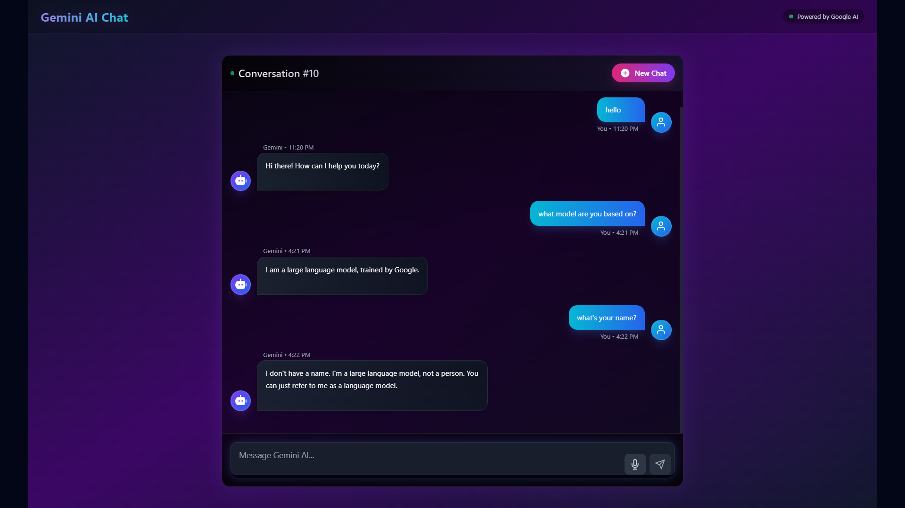

# Gemini Chat App

A modern chat application powered by Google's Gemini AI, built with React and Node.js, powered by Gemini and Claude.



## Features

- Real-time chat interface with Google's Gemini AI
- Modern UI with animations and transitions
- Message history persistence
- Conversation management
- Responsive design
- Typing indicators
- Dark mode interface

## Tech Stack

- **Frontend:**

  - React
  - Tailwind CSS
  - Framer Motion
  - Axios

- **Backend:**
  - Node.js
  - Express
  - MS SQL Server
  - Google Gemini AI API

## Setup

### Prerequisites

- Node.js
- MS SQL Server
- Google Gemini API Key

### Installation

1. Clone the repository:

```bash
git clone <repository-url>
```

2. Install dependencies:

```bash
# Install frontend dependencies
cd client
npm install

# Install backend dependencies
cd ../server
npm install
```

3. Configure environment variables:

```bash
# In server/.env
GEMINI_API_KEY=your_gemini_api_key
DB_USER=your_db_user
DB_PASSWORD=your_db_password
DB_SERVER=your_db_server
DB_DATABASE=your_db_name
```

4. Start the application:

```bash
# Start backend server
cd server
npm run dev

# Start frontend (in a new terminal)
cd client
npm run dev
```

5. Open `http://localhost:5173` in your browser


